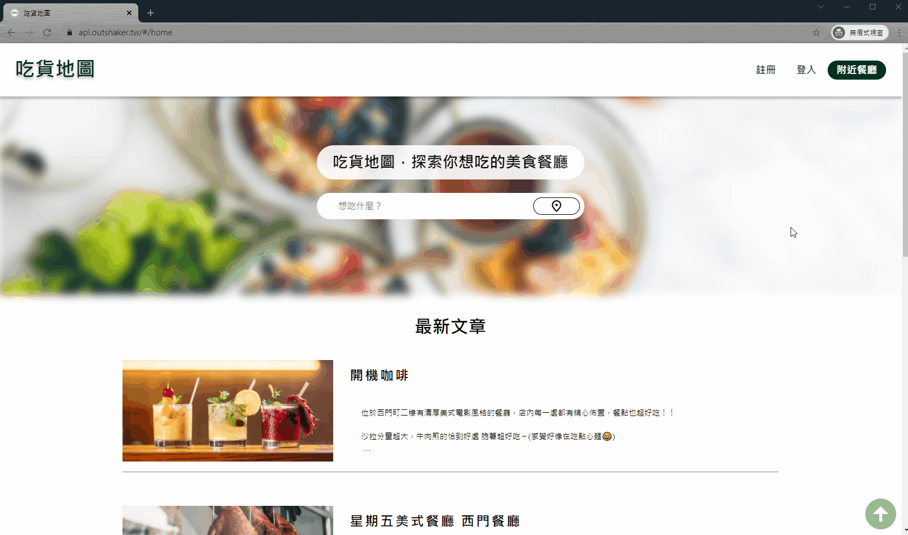
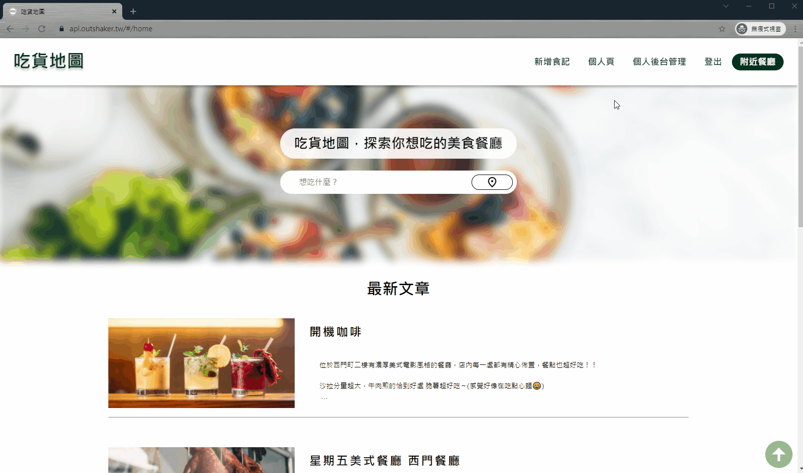
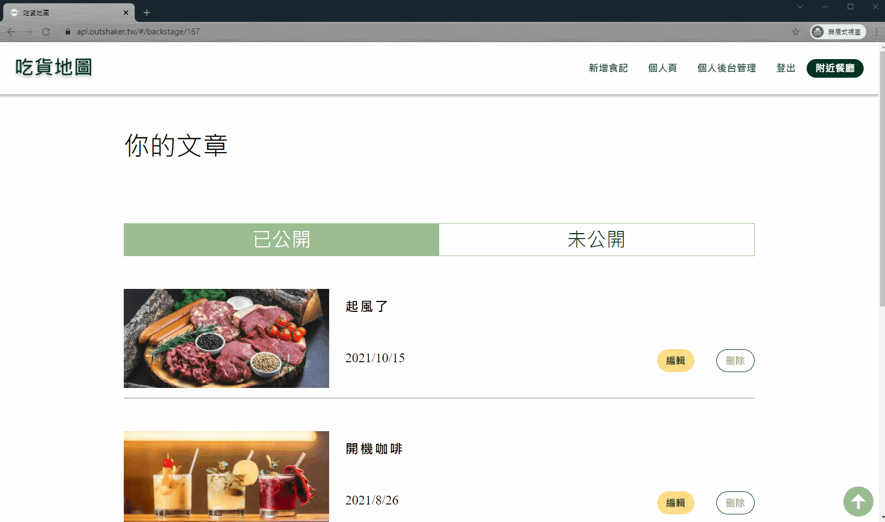
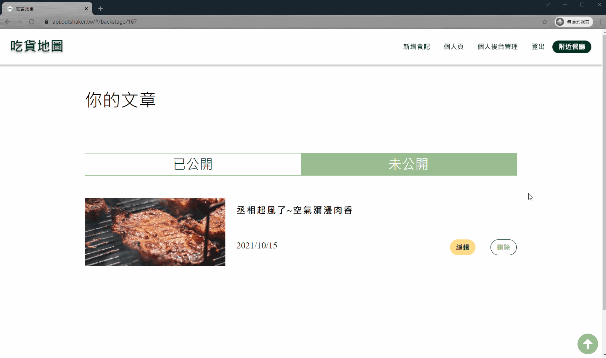
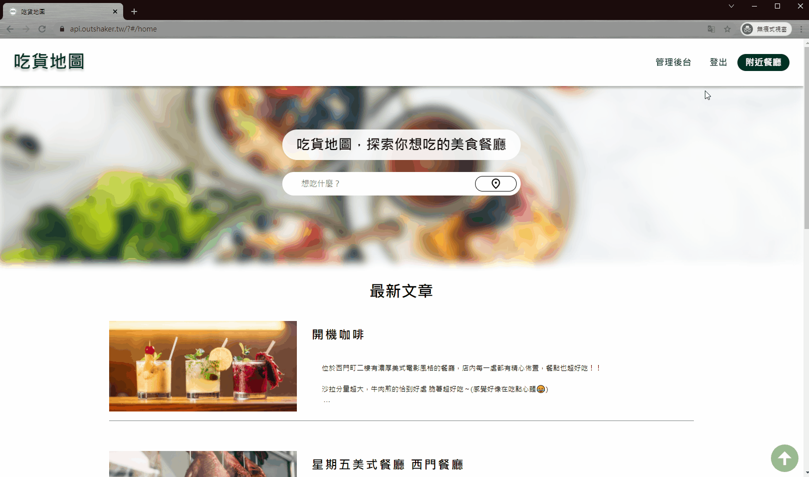

# 吃貨地圖

### 今晚想來點...?
> 不再猶豫，
> 交給吃貨地圖幫你做決定

[網站DEMO](https://api.outshaker.tw/#/home)

## 專案介紹
在這個生活越來越方便，美食越來越多的社會裡，不知道要吃什麼，總是猶豫不決，這是很多人都有過的困擾。

為了能夠快速解決這個問題，只要輸入所在地，除了會顯示附近二十家餐廳外，還有一個好手氣按鈕，隨機幫你選中一家餐廳。吃貨地圖還提供你記錄自己的美食日記，沒有複雜的介面，簡簡單單紀錄你此時此刻吃到的每一口感受。

## 專案功能
- 前台
    - 使用者
        - 輸入位置，顯示附近二十家餐廳
        - 好手氣，隨機幫你選一家餐廳
        - 查詢餐廳資訊
        - 紀錄美食日記
        - 觀看他人食記
- 後台
    - 使用者
        - 編輯、刪除文章
        - 查看未公開日記
    - 管理者
        - 查看所有使用者
        - 更改使用者權限 

## 專案展示


| 測試身分 | 帳號 | 密碼 |
| -------- | ---- | ---- |
|    使用者     | user001     | user001     |
|   管理員 | amdin001 | amdin001 |

### 使用者
- 登入


- 好手氣


- 新增食記


- 編輯食記 / 將食記設為未公開 


- 刪除食記



### 管理者
- 管理使用者



## 專案執行
`npm install` 安裝專案所需套件。

`npm run start` 啟動專案。

`npm build` 在資料夾中建立此專案的 production 版本

`npm deploy` 在 GitHub Pages 部屬專案網站。

## 使用技術
- React Hooks
- React DOM
- 套件
    - React Router
    - Redux Toolkit
    - styled components
    - PropTypes
    - lodash
    - Google Map React
    - ckeditor5-react
    - reactjs-popup
    - react-images-viewer
    - nuka-carousel
- API
    - Imgur
    - Google Map

## 專案結構
```
src
│  App.js
│  index.js
│  utils.js
│  WebAPI.js
│  
├─components
│  ├─Article
│  │      Article.js
│  │      ArticleFilter.js
│  │      ArticleInfo.js
│  │      ArticleStyle.js
│  │      index.js
│  │      
│  ├─BackToTop
│  │      BackToTop.js
│  │      BackToTopStyle.js
│  │      index.js
│  │      
│  ├─Error
│  │      Error.js
│  │      ErrorStyle.js
│  │      
│  ├─Footer
│  │      Footer.js
│  │      FooterStyle.js
│  │      index.js
│  │      
│  ├─Form
│  │      Form.js
│  │      FormStyle.js
│  │      index.js
│  │      
│  ├─ImageViewer
│  │      ImageViewer.js
│  │      index.js
│  │      ReactImageViewer.js
│  │      
│  ├─Loading
│  │      Loading.js
│  │      LoadingStyle.js
│  │      
│  ├─Map
│  │      key.js
│  │      map.js
│  │      mapComponents.js
│  │      
│  ├─Navbar
│  │      index.js
│  │      Navbar.js
│  │      NavbarStyle.js
│  │      UserNavbar.js
│  │      
│  ├─pictures // images
│  │      
│  ├─PopUp
│  │      PopUp.js
│  │      
│  └─Search
│          index.js
│          Search.js
│          SearchStyle.js
│          
├─constants
│      globalStyle.js
│      style.js
│      
├─hooks
│      useConfirmUser.js
│      useEditUserData.js
│      useError.js
│      useGetId.js
│      useLoading.js
│      useLogin.js
│      useParseData.js
│      usePost.js
│      useRegister.js
│      useScroll.js
│      
├─pages
│  ├─administrator
│  │  └─AdminPage
│  │          AdminPage.js
│  │          AdminStyled.js
│  │          index.js
│  │          UserTable.js
│  │          
│  ├─blog
│  │  ├─ArticlePage
│  │  │      ArticlePage.js
│  │  │      ArticlePageStyle.js
│  │  │      ckeditorStyle.css
│  │  │      index.js
│  │  │      
│  │  ├─BackStagePage
│  │  │      BackStagArticle.js
│  │  │      BackStagePage.js
│  │  │      BackStagStyled.js
│  │  │      index.js
│  │  │      
│  │  ├─EditPage
│  │  │      EditPage.js
│  │  │      EditPageStyle.js
│  │  │      index.js
│  │  │      
│  │  ├─HomePage
│  │  │      HomePage.js
│  │  │      HomePageStyle.js
│  │  │      index.js
│  │  │      
│  │  ├─NearbyPage
│  │  │      index.js
│  │  │      NearbyPage.js
│  │  │      NearbyPageStyle.js
│  │  │      
│  │  ├─ProfilePage
│  │  │      index.js
│  │  │      ProfilePage.js
│  │  │      ProfilePageStyled.js
│  │  │      
│  │  └─SearchPage
│  │          index.js
│  │          SearchPage.js
│  │          SearchPageStyle.js
│  │          
│  └─user
│      ├─LoginPage
│      │      index.js
│      │      LoginPage.js
│      │      
│      └─RegisterPage
│              index.js
│              RegisterPage.js
│              
└─redux
    │  store.js
    │  
    └─reducers
            userReducer.js        
```

## 專案後端
吃貨地圖後端，採用 Express、Sequelize 開發。
- [專案後端連結](https://github.com/outshaker/foodmap-backend)


## 專案授權
- [MIT](https://choosealicense.com/licenses/mit/)
